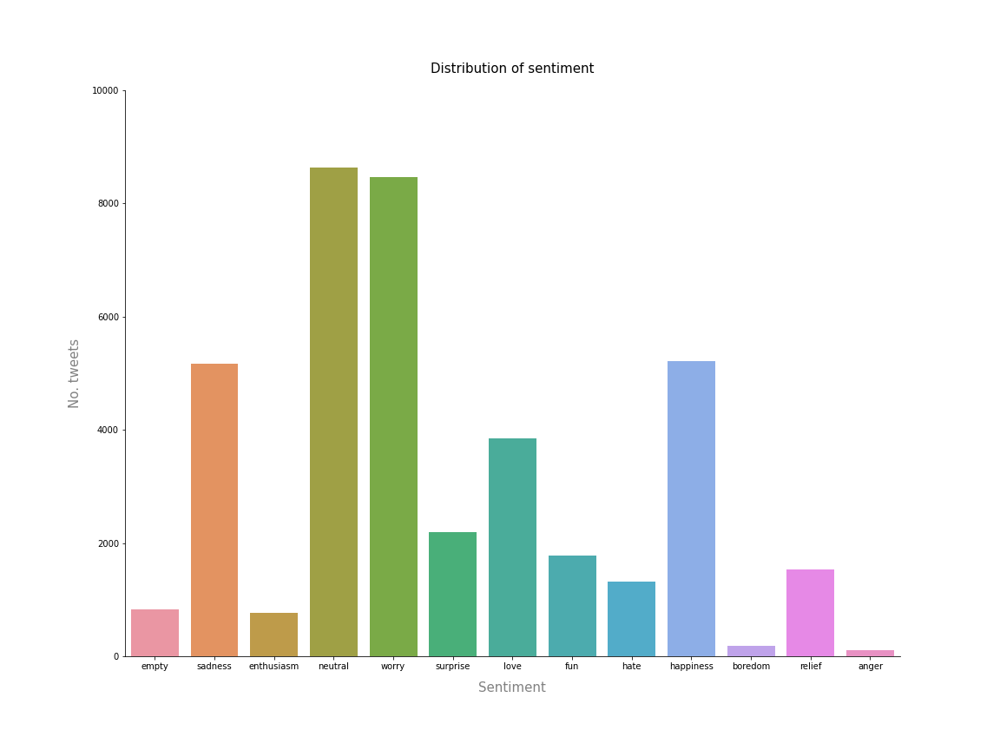

# 🍫 Sentiment Analysis: Project Overview
*   End to end project creating pipline to analyse sentiment in text.
*   Logistic Regression used to classify sentiment  (Natural Language Processing)

## Table of Contents 
[Resources](#resources)<br>
[Data Collection](#DataCollection)<br>
[Data Pre-processing](#DataPre-processing)<br>
[Data Warehousing](#DataWarehousing)<br>
[Exploratory data analysis](#EDA)<br>
[Feature Engineering](#FeatEng)<br>
[ML/DL Model Building](#ModelBuild)<br>
[Model performance](#ModelPerf)<br>
[Model Evaluation](#ModelEval)<br>
[Project Management (Agile | Scrum)](#Prjmanage)<br>
[Project Evaluation](#PrjEval)<br>
[Looking Ahead](#Lookahead)<br>
[Questions | Contact me ](#Lookahead)<br>

<a name="Resources"></a>  

## Resources Used
**Python 3, PostgreSQL** 

[**Anaconda Packages:**](requirements.txt) **pandas numpy sklearn matplotlib seaborn sqlalchemy kaggle psycopg2 ipykernel neattext** <br><br>
Powershell command for installing anaconda packages used for this project  
```powershell
pip install pandas numpy sklearn matplotlib seaborn sqlalchemy kaggle psycopg2 ipykernel neattext 
```

<a name="DataCollection"></a>  

## [Data Collection](Code/P7_Code.ipynb)
Powershell command for data import using kaggle API <br>
```powershell
!kaggle datasets download -d pashupatigupta/emotion-detection-from-text -p ..\Data --unzip
```
[Data source link](https://www.kaggle.com/pashupatigupta/emotion-detection-from-text)
[Data](Data/tweet_emotions.csv)
*  Rows: 40000 | Columns: 3
    *   tweet_id                   
    *   sentiment                      
    *   content                        

<a name="DataPre-processing"></a>  

## [Data Pre-processing](Code/P7_Code.ipynb)
After I had all the data I needed, I needed to check it was ready for exploration and later modelling. I made the following changes and created the following variables:   
*   General NULL and data validity checks  
*   Any NULL fields in the sentiment or content columns would have been dropped. 

<a name="DataWarehousing"></a>

## [Data Warehousing](Code/P7_Code.ipynb)
I warehouse all data in a Postgre database for later use and reference.

*   ETL in python to PostgreSQL Database.
*   Formatted column headers to SQL compatibility.  

<a name="EDA"></a>  

## [Exploratory data analysis](Code/P7_Code.ipynb) 
I looked at the distributions of the data and the value counts for the various categorical variables that would be fed into the model. 
*   Distribution of sentiment categories 




<a name="FeatEng"></a>  

## [Feature Engineering](Code/P7_Code.ipynb) 
neattext libray was used to clean text. I also split the data into train and tests sets with a test size of 20%.
```python
# Viewing cleaning potential of nfx
dir(nfx)

# Using nfx to clean textual data
data['clean_text'] = data['content'].apply(nfx.remove_userhandles)
data['clean_text'] = data['clean_text'].apply(nfx.remove_stopwords)
```
<!-- *   One Hot encoding to encode values -->
  

<a name="ModelBuild"></a> 

## [ML/DL Model Building](Code/P7_Code.ipynb)

I used a CountVectorizer to find the count of words in each statement. I then added a LogisticRegression algorithm. I get both of these methods into a pipeline for ease of use later. 
```python
# Logistic Regression Pipeline
pipe_lr = Pipeline(steps=[('cv',CountVectorizer()),('lr',LogisticRegression())])
```


<a name="ModelPerf"></a> 

## [Model performance](Code/P7_Code.ipynb)
The Logistic Regression model performed quite poorly on the test set. 
*   **Logistic Regression** : Accuracy = 33.85% 
```python
# Checking Accuracy
pipe_lr.score(X_test,y_test)
```
<!-- 
<a name="ModelOpt"></a> 

## [Model Optimisation](Code/P7_Code.ipynb)
In this step, I used GridsearchCV and RandomizedSearchCV to find the best parameters to optimise the performance of the model.
Using the best parameters, I improved the SVC model accuracy of SVC by **1.3%**. The Logistic Regression model however saw no increase in accuracy. 

*   **Logistic Regression** : Accuracy = 77.92% | MSE = 0.22 | RMSE =  0.47 (2dp)
*   **SVC** : Accuracy = 77.27%  | MSE = 0.23 | RMSE =  0.48 (2dp)   -->

<a name="ModelEval"></a> 

## [Model Evaluation](Code/P7_Code.ipynb)
*   I evaluated the model as always... by using it. 
```python
# Model testing
extext = "I love basketball, it makes me happy!"

# Model prediction
pipe_lr.predict([extext])

### OUTPUT ### 
# array(['love'], dtype=object)
``` 
<!-- 
*   Logistic Regression 


*   Support Vector Classification


*   Plotting the ROC Curve gave me some key insight to select the best performing model. Although Logistic regression has a higher accuracy value, I selected the SVC model as the ROC Curve shows the SVC to predict more true positives and true negative which is key for deployment and use in unseen data. 


<a name="ModelProd"></a> 

## [Model Productionisation](Code/P7_Code.ipynb)
*   I used the pickle library to export the model. 
```python
# Dump model into pickle file
pickle.dump(model1, open('.././svc_diabetes.pkl', 'wb'))
```  

<a name="ModelDeploy"></a> 

## [Deployment](app.py)
I built a flask REST API endpoint that was hosted on a local webserver before Heroku deployment. The API endpoint takes in request values and returns prediction of diabetes diagnosis. I also optimised and formatted the frontend using HTML and CSS.  -->

<a name="Prjmanage"></a> 

## [Project Management (Agile | Scrum)](https://www.atlassian.com/software/jira)
* Resources used
    * Jira
    * Confluence
    * Trello 

<a name="PrjEval"></a> 

## [Project Evaluation](Presentation/P11Presentation.pptx) 
*   WWW
    *   The end-to-end process
    *   POC NLP project  
*   EBI 
    *   Better project management and planning would have made this project faster
    

<a name="Lookahead"></a> 

## Looking Ahead
*   Financial markets, sentiment analysis..... ? 


<a name="Questions"></a> 

## Questions | Contact me 
For questions, feedback, and contribution requests contact me
* ### [Click here to email me](mailto:theanalyticsolutions@gmail.com) 
* ### [See more projects here](https://github.com/MattithyahuData?tab=repositories)


